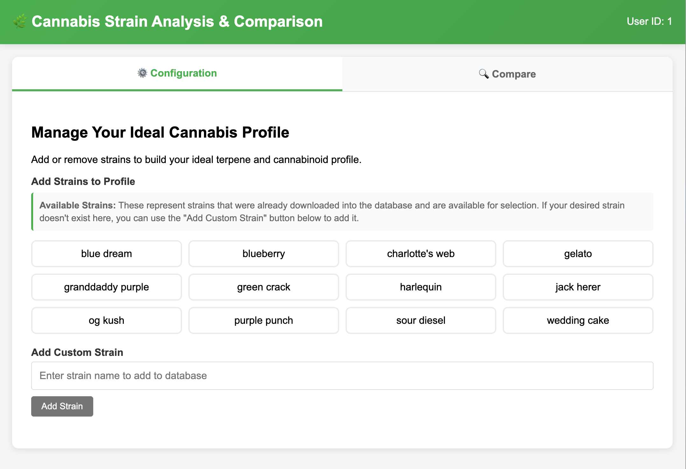
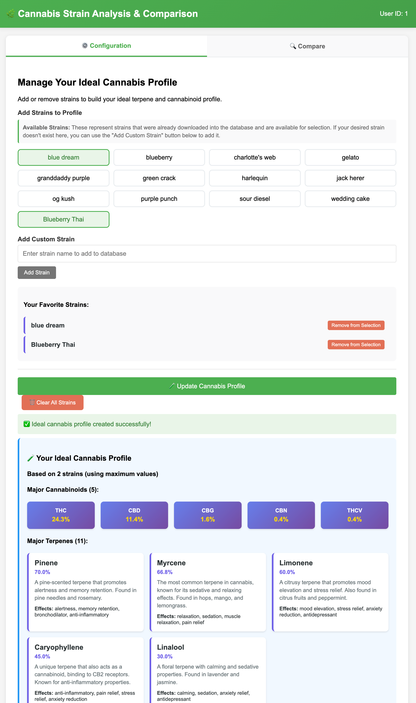
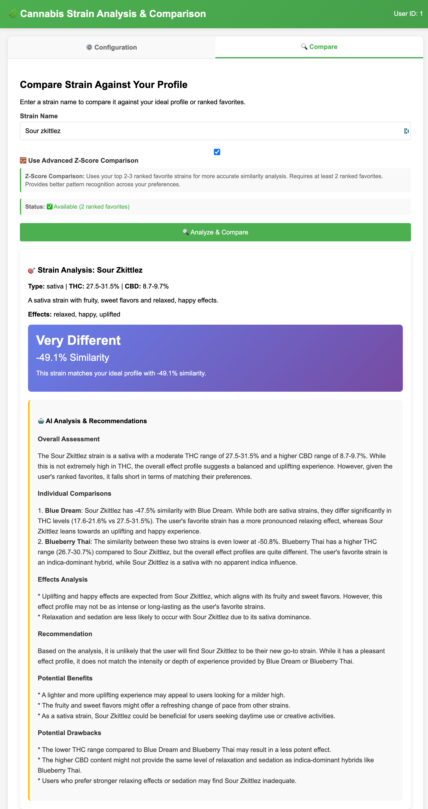

# 🌿 Cannabis Strain Analyzer

An advanced cannabis strain analysis and recommendation system that uses comprehensive terpene and cannabinoid profiling with z-scored similarity matching to provide personalized strain recommendations.

## 🚀 Features

- **Comprehensive Chemovar Analysis**: Analyzes both terpenes and cannabinoids using a fixed schema
- **Advanced Z-Scored Similarity Matching**: Uses multiple ranked profiles for robust strain comparison
- **Ranked Favorites System**: Rank your favorite strains for enhanced similarity analysis
- **Dual Comparison Methods**: Choose between ideal profile or ranked favorites comparison
- **Personalized Profiles**: Create ideal terpene/cannabinoid profiles from your favorite strains
- **AI-Powered Generation**: Generates realistic strain data using LLM when strains aren't found
- **Interactive Web Interface**: Clean, tabbed interface for configuration and comparison
- **Conservative Imputation**: Handles missing data with scientifically-backed default values

## 🧬 Scientific Approach

### Fixed Schema Implementation

The system uses a comprehensive fixed schema for consistent analysis:

**Major Cannabinoids (5):**
- THC (0-30%)
- CBD (0-15%) 
- CBG (0-2%)
- CBN (0-1%)
- THCV (0-0.5%)

**Major Terpenes (11):**
- **Primary**: myrcene, limonene, caryophyllene, pinene, linalool
- **Secondary**: humulene, terpinolene, ocimene, nerolidol, bisabolol, eucalyptol

### Z-Scored Cosine Similarity

The system implements the recommended approach for robust chemovar comparison:

```
cos(θ) = x·y / (||x|| ||y||)
```

Where `x` and `y` are z-scored (standardized) terpene + cannabinoid vectors. This approach:

- **Normalizes data** to focus on profile shape rather than absolute magnitudes
- **Handles missing values** with conservative imputation
- **Provides robust comparison** across different strain batches and products
- **Eliminates bias** from dominant terpenes/cannabinoids

### Multi-Metric Analysis

The system combines multiple similarity metrics:

1. **Z-Scored Cosine Similarity (50%)**: Primary metric for chemovar shape
2. **Z-Scored Euclidean Similarity (20%)**: Distance-based comparison
3. **Z-Scored Correlation (20%)**: Profile pattern correlation
4. **Original Cosine Similarity (10%)**: Reference metric

## 🏆 Ranked Favorites System

### Enhanced Similarity Analysis

The system now supports two comparison approaches:

#### **1. Ideal Profile Comparison (Traditional)**
- Creates an aggregate profile using maximum values from all favorite strains
- Uses fallback cosine similarity when z-scoring fails with 2 vectors
- Provides consistent baseline comparisons

#### **2. Ranked Favorites Comparison (Advanced)**
- **Rank your favorite strains** from most preferred (1) to least preferred
- **Z-scoring works properly** with 3+ vectors (strain + top 2-3 favorites)
- **More accurate similarity** through pattern recognition across multiple profiles
- **Individual comparisons** show how the strain matches each favorite

### When Z-Scoring Works

Z-scoring requires **3+ vectors** for stable standardization:
- **2 vectors**: Strain vs Ideal Profile → Falls back to cosine similarity
- **3+ vectors**: Strain vs Top 2-3 Ranked Favorites → Z-scoring enabled
- **Better accuracy**: Multiple profiles provide meaningful standardization

## 🛠️ Installation

### Prerequisites

- Python 3.11 or higher
- [uv](https://docs.astral.sh/uv/) package manager

### Quick Start

```bash
# Clone the repository
git clone <repository-url>
cd cannabis-strain-analyzer

# Install dependencies
make install

# Start the application
make run
```

The application will be available at `http://localhost:8000`

## 📸 Screenshots

### Configuration Tab - Managing Your Ideal Cannabis Profile

The Configuration tab provides a comprehensive interface for building and managing your personalized cannabis profile:



**Interface Features:**
- **Clean Header**: Green banner with "Cannabis Strain Analysis & Comparison" title and User ID display
- **Tab Navigation**: Easy switching between Configuration and Compare tabs with visual indicators
- **Current Profile Summary**: Large blue/purple display showing aggregated cannabis profile with:
  - **Strains (2)**: "blue dream, Blueberry Thai"
  - **Major Cannabinoids (5)**: THC: 24.3%, CBD: 11.4%, CBG: 1.6%, CBN: 0.4%, THCV: 0.4%
  - **Major Terpenes (11)**: Complete breakdown with percentages (myrcene: 66.8%, pinene: 70.0%, etc.)
  - **Top Effects**: happy, uplifted, creative, relaxed, focused
  - **Medical Effects**: pain relief, depression, stress, anxiety
  - **Flavors & Aromas**: sweet, berry, earthy profiles

**Interactive Elements:**
- **Strain Selection Grid**: Clickable buttons for available strains with visual selection indicators
- **Custom Strain Addition**: Input field and "Add Strain" button for new strains
- **Profile Management**: "Update Cannabis Profile" and "Clear All Strains" buttons
- **Real-time Updates**: Profile updates immediately as you add/remove strains
- **Status Messages**: Success notifications when profiles are created

### Compare Tab - Advanced Strain Analysis

The Compare tab provides detailed strain analysis and similarity comparison with advanced z-score functionality:



**Analysis Interface:**
- **Strain Input**: Clean text field for entering strain names (shown with "Sour zkittlez")
- **Z-Score Toggle**: Checkbox for advanced z-score comparison with help text
- **Status Indicators**: Real-time status showing "✅ Available (2 ranked favorites)"
- **Analysis Button**: Green "🌿 Analyze & Compare" button to start analysis

**Results Display:**
- **Strain Analysis**: Complete strain information (Type: sativa, THC: 27.5-31.5%, CBD: 8.7-9.7%)
- **Similarity Results**: Large purple box showing "-49.1% Similarity" with "Very Different" rating
- **AI Recommendations**: Comprehensive analysis including:
  - Overall assessment of strain compatibility
  - Individual comparisons with ranked favorites (Blue Dream: -47.5%, Blueberry Thai: -50.8%)
  - Effects analysis and recommendations
  - Potential benefits and drawbacks
  - Detailed explanations of why the strain matches or differs from preferences

### Additional Screenshots

Here are additional views of the application interface:


*Configuration tab showing detailed profile breakdown with all cannabinoids and terpenes*



*Compare tab displaying comprehensive strain analysis and AI recommendations*

## 📖 Usage

### Web Interface

The application provides a clean tabbed interface:

#### Configuration Tab
1. **Select Favorite Strains**: Choose from available strains or add custom strains
2. **Individual Management**: Add/remove strains from your profile with real-time updates
3. **Create Ideal Profile**: Generate comprehensive cannabis profile using maximum values
4. **Profile Display**: View your complete profile with all cannabinoids and terpenes
5. **Profile Management**: Update, clear, or modify your ideal profile anytime

#### Compare Tab
1. **Enter Strain Name**: Type the strain you want to analyze
2. **Get Analysis**: Receive comprehensive similarity analysis
3. **View Results**: See detailed terpene/cannabinoid differences and AI recommendations

### API Endpoints

The system provides RESTful API endpoints:

- `POST /api/set-user` - Set current user
- `GET /api/available-strains` - Get list of available strains
- `POST /api/create-ideal-profile` - Create ideal profile from selected strains
- `POST /api/add-strain-to-profile` - Add individual strain to profile
- `POST /api/remove-strain-from-profile` - Remove individual strain from profile
- `POST /api/compare-strain` - Compare strain against ideal profile
- `GET /api/user-profile` - Get user profile and ideal profile
- `GET /api/ideal-profile` - Get current ideal profile

## 🧪 How Matching Works

### 1. Ideal Profile Creation
When you select favorite strains, the system creates your ideal cannabis profile using **maximum values** (not averages) for each compound:

#### Why Maximum Values?
- **Represents Peak Preferences**: Your ideal profile should reflect the highest levels of compounds you enjoy
- **Captures Full Range**: Shows the maximum potential of effects you prefer
- **Better Matching**: More accurate similarity comparison with strains that have high levels of your preferred compounds

#### Profile Generation Process:
1. **Collect Data**: Gathers all terpene and cannabinoid data from your selected strains
2. **Calculate Maximums**: For each compound, takes the highest value across all strains
3. **Normalize to Schema**: Ensures all 16 compounds (5 cannabinoids + 11 terpenes) are represented
4. **Conservative Imputation**: Fills missing values with scientifically-backed defaults
5. **Create Profile**: Generates your personalized ideal cannabis profile

#### Example:
If you select 3 strains with THC levels of 15%, 22%, and 18%, your ideal profile will have **22% THC** (the maximum), not 18.3% (the average).

#### Profile Display Format:
Your ideal cannabis profile displays all compounds with their maximum values:

**Major Cannabinoids (5):**
- THC: 22.0%, CBD: 3.5%, CBG: 1.2%, CBN: 0.8%, THCV: 0.3%

**Major Terpenes (11):**
- myrcene: 0.65%, limonene: 0.45%, caryophyllene: 0.35%, pinene: 0.52%, linalool: 0.28%, humulene: 0.15%, terpinolene: 0.12%, ocimene: 0.08%, nerolidol: 0.05%, bisabolol: 0.04%, eucalyptol: 0.02%

This comprehensive view shows exactly what your ideal cannabis profile looks like across all major compounds.

### 2. Strain Analysis
For each comparison strain:
- Normalizes to fixed schema with conservative imputation
- Generates missing data using AI if needed
- Creates standardized chemovar vector

### 3. Similarity Calculation
The system calculates:
- **Z-scored vectors** for both ideal and comparison profiles
- **Multiple similarity metrics** for comprehensive analysis
- **Combined similarity score** with weighted averaging
- **Component differences** showing individual terpene/cannabinoid variations

### 4. Results Interpretation
- **90%+**: Perfect Match
- **70-89%**: Excellent Match  
- **50-69%**: Good Match
- **30-49%**: Moderate Match
- **<30%**: Poor Match

## 🔧 Development

### Available Commands

```bash
make install    # Install dependencies and create virtual environment
make run        # Start the web application
make test       # Run tests
make clean      # Clean up generated files and virtual environment
```

### Project Structure

```
cannabis-strain-analyzer/
├── app.py                          # Main application
├── enhanced_strain_database.py     # Strain database management
├── templates/
│   └── index.html                  # Web interface template
├── pyproject.toml                  # Project configuration
├── Makefile                        # Build automation
├── README.md                       # This file
└── Architecture.md                 # Technical architecture documentation
```

### Key Components

- **Fixed Schema**: Comprehensive terpene/cannabinoid profiles
- **Conservative Imputation**: Scientific default values for missing data
- **Z-Scored Similarity**: Advanced mathematical comparison
- **AI Integration**: LLM-powered strain data generation
- **Web Interface**: Clean, responsive user interface

## 🧬 Scientific Background

### Terpenes
Terpenes are aromatic compounds that influence cannabis effects:
- **Myrcene**: Sedative, relaxing effects
- **Limonene**: Mood elevation, stress relief
- **Caryophyllene**: Anti-inflammatory, pain relief
- **Pinene**: Alertness, memory retention
- **Linalool**: Calming, anxiety relief

### Cannabinoids
Cannabinoids are the primary active compounds:
- **THC**: Psychoactive effects, euphoria
- **CBD**: Non-psychoactive, therapeutic benefits
- **CBG**: Precursor cannabinoid, potential therapeutic value
- **CBN**: Sedative effects, sleep aid
- **THCV**: Appetite suppressant, energizing

## 📊 Example Analysis

```json
{
  "similarity_percentage": 75.4,
  "match_rating": "Very Good Match",
  "similarity_breakdown": {
    "z_scored_cosine_similarity": 0.85,
    "z_scored_euclidean_similarity": 0.72,
    "z_scored_correlation_similarity": 0.78,
    "combined_similarity": 0.754
  },
  "component_differences": {
    "myrcene": {
      "strain_value": 0.45,
      "ideal_value": 0.65,
      "difference": -0.20,
      "percentage_diff": -30.8,
      "type": "terpene"
    }
  }
}
```

## 🤝 Contributing

1. Fork the repository
2. Create a feature branch
3. Make your changes
4. Add tests if applicable
5. Submit a pull request

## 📄 License

This project is licensed under the MIT License - see the LICENSE file for details.

## 🙏 Acknowledgments

- Scientific research on cannabis terpenes and cannabinoids
- Z-scored similarity methodology for chemovar comparison
- Conservative imputation strategies for missing data
- AI/ML community for similarity algorithms

---

**Note**: This system is for educational and research purposes. Always consult with healthcare professionals regarding cannabis use.