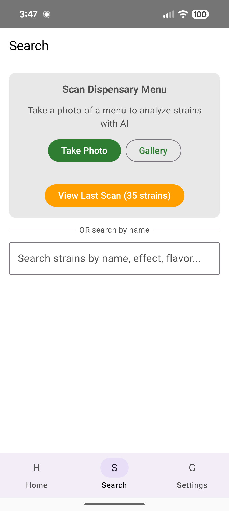
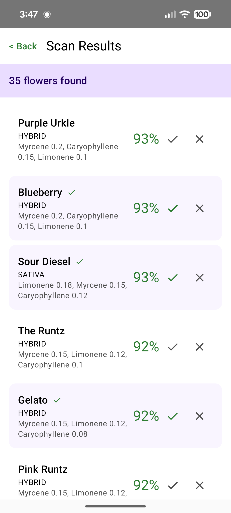

<div align="center">

# BudMash

### Your Personal Terpene-Based Strain Matcher

*Find cannabis strains that match your chemistry, not just your guesses.*

[](https://github.com/usathyan/cannabis-strain-analyzer/actions)
[](https://github.com/usathyan/cannabis-strain-analyzer/releases)
[](#)
[](https://openrouter.ai)

---

<table>
<tr>
<td></td>
<td></td>
<td></td>
<td></td>
</tr>
<tr>
<td align="center"><b>Your Profile</b></td>
<td align="center"><b>Scan Menu</b></td>
<td align="center"><b>Similarity Breakdown</b></td>
<td align="center"><b>Terpene Analysis</b></td>
</tr>
</table>

</div>

---

## Powered by Generative AI

BudMash harnesses the power of cutting-edge **Generative AI** to transform how you discover cannabis strains. Simply snap a photo of any dispensary menu, and our AI instantly extracts every strain, fetches terpene profiles, and calculates personalized match scores—all in seconds.

No more manually searching strain databases. No more guessing. Just **science-backed recommendations** tailored to your unique preferences.

<div align="center">

| What You Do | What AI Does |
|-------------|--------------|
| Take a screenshot | Extracts 50+ strains in seconds |
| Like strains you enjoy | Builds your chemical fingerprint |
| Walk into any dispensary | Instantly know your best matches |

</div>

---

## The Problem

You walk into a dispensary. The menu has 50+ flower strains. Some you've tried, most you haven't. You know what you like—but how do you find *more* of it?

**BudMash solves this.** It builds a terpene profile from strains you've enjoyed, then scores every strain on the menu against your preferences using real chemistry.

---

## How It Works

### 1. Build Your Profile

Like strains you know you enjoy. BudMash extracts the terpene profile from each one and builds your ideal chemical signature using **MAX pooling**:

```
You like Blue Dream  → Myrcene: 0.4%, Limonene: 0.3%
You like Sour Diesel → Myrcene: 0.2%, Limonene: 0.5%
─────────────────────────────────────────────────────
Your Profile         → Myrcene: 0.4%, Limonene: 0.5%  ← takes the MAX
```

This preserves your peak preferences. If you respond well to high limonene in one strain and high myrcene in another, both are captured.

### 2. Scan Any Dispensary Menu

Take a screenshot of your dispensary's flower menu. BudMash uses AI vision to extract every strain, then fetches terpene data for each one.

### 3. Get Match Scores

Every strain is scored against your profile. A 93% match means the chemistry aligns with what you've liked before.

<div align="center">
<table>
<tr>
<td></td>
<td width="40"></td>
<td></td>
</tr>
<tr>
<td align="center"><em>Strains ranked by match %</em></td>
<td></td>
<td align="center"><em>Detailed similarity breakdown</em></td>
</tr>
</table>
</div>

---

## AI Setup Guide

BudMash uses [**OpenRouter**](https://openrouter.ai)—a unified API gateway that provides access to the world's best AI models from Google, Anthropic, OpenAI, and more. One API key unlocks hundreds of models at competitive prices.

### Why OpenRouter?

- **Best-in-class models**: Access Gemini, Claude, GPT-4, and more
- **Pay-as-you-go**: No subscriptions, only pay for what you use
- **Transparent pricing**: See exactly what each request costs
- **Privacy-focused**: Your data isn't used to train models

### Step 1: Create Your OpenRouter Account

1. Visit [**openrouter.ai**](https://openrouter.ai)
2. Click **"Sign Up"** (top right)
3. Sign up with Google, GitHub, or email
4. Verify your email if required

### Step 2: Add Credits

1. Go to [**openrouter.ai/credits**](https://openrouter.ai/credits)
2. Click **"Add Credits"**
3. Add **$5** to start (this will last 500+ menu scans!)
4. Complete payment via Stripe

### Step 3: Get Your API Key

1. Go to [**openrouter.ai/keys**](https://openrouter.ai/keys)
2. Click **"Create Key"**
3. Name it something like "BudMash"
4. Copy the key (starts with `sk-or-...`)
5. Paste it in BudMash **Settings**

<div align="center">

</div>

### What It Costs

BudMash uses two AI services, both incredibly affordable:

| Service | Model | What It Does | Cost |
|---------|-------|--------------|------|
| **Menu Scanning** | Gemini 2.0 Flash | Reads your screenshot, extracts strain names | ~$0.001 per scan |
| **Strain Analysis** | Claude 3 Haiku | Generates insights about terpene effects | ~$0.001 per strain |

<div align="center">

### **Real-World Cost Examples**

| Usage | Estimated Cost |
|-------|----------------|
| Scan 1 menu (35 strains) | Less than $0.01 |
| Scan 10 menus | ~$0.05 |
| Heavy use for a month | ~$0.50 |
| **$5 credit lasts** | **500+ scans** |

</div>

> **Bottom line:** A $5 credit will last most users *months* of regular use. This isn't a subscription—you own your credits and they never expire.

---

## The Science

BudMash uses three complementary algorithms weighted together:

| Algorithm | Weight | What It Measures |
|-----------|--------|------------------|
| **Z-Score Cosine** | 50% | Profile shape—do you emphasize the same terpenes? |
| **Euclidean Distance** | 25% | Absolute concentrations—are the amounts similar? |
| **Pearson Correlation** | 25% | Pattern matching—do the profiles move together? |

### Why Z-Score Normalization?

Raw terpene percentages vary wildly. Myrcene might be 0.5% while Terpinolene is 0.05%. Without normalization, high-concentration terpenes dominate.

**Z-scoring puts all terpenes on equal footing.** Your preference for rare Terpinolene matters as much as common Myrcene.

<details>
<summary><b>Click for the math</b></summary>

<br>

**Z-Score Normalization:**
```
z = (value - mean) / standard_deviation
```

**Cosine Similarity:**
```
similarity = dot(A, B) / (||A|| × ||B||)
```

**Combined Score:**
```
score = (0.50 × cosine) + (0.25 × euclidean) + (0.25 × pearson)
```

A strain scoring 90%+ matches both the *shape* and *intensity* of your preferences.

</details>

---

## Terpene Reference

| Terpene | Aroma | Effects |
|---------|-------|---------|
| **Myrcene** | Earthy, musky | Relaxation, sedation |
| **Limonene** | Citrus | Mood elevation, stress relief |
| **Caryophyllene** | Pepper, spicy | Anti-inflammatory, calming |
| **Pinene** | Pine | Alertness, memory |
| **Linalool** | Lavender | Anxiety relief, relaxation |
| **Humulene** | Hoppy | Appetite suppression |
| **Terpinolene** | Floral, herbal | Uplifting, antioxidant |

---

## Quick Start

<table>
<tr>
<td width="50%" valign="top">

### Step 1: Get API Key

Create a free [OpenRouter](https://openrouter.ai) account, add $5 credit, and copy your API key.

</td>
<td width="50%" valign="top">

### Step 2: Configure App

Open BudMash, go to **Settings**, paste your API key, and save.


</td>
</tr>
</table>

<table>
<tr>
<td width="50%" valign="top">

### Step 3: Build Profile

Like 3-5 strains you know you enjoy. Your terpene profile builds automatically.


</td>
<td width="50%" valign="top">

### Step 4: Scan & Match

Screenshot any dispensary menu. See every strain scored against your profile.


</td>
</tr>
</table>

---

## Tips

- **Like 3-5 strains** before scanning for best results
- **Tall screenshots** are handled automatically via image chunking
- **Dislike strains too**—tracking what you avoid helps you remember
- Your profile **evolves** as you like more strains

---

## Privacy

- Terpene profile stored **locally on your device**
- API keys stored in **device secure storage**
- Menu images sent to AI for processing, then discarded
- **No accounts, no tracking, no ads**

---

## Download

<div align="center">

| Platform | Download | Status |
|----------|----------|--------|
| **Android** | [**Download APK**](https://github.com/usathyan/cannabis-strain-analyzer/releases/latest) | Available |
| iOS | Coming Soon | In Development |

</div>

---

## Links

- [OpenRouter](https://openrouter.ai) — AI API provider
- [OpenRouter Pricing](https://openrouter.ai/models) — See all model costs
- [Gemini 2.0 Flash](https://openrouter.ai/models/google/gemini-2.0-flash-001) — Vision model we use
- [Claude 3 Haiku](https://openrouter.ai/models/anthropic/claude-3-haiku) — Analysis model we use

---

<div align="center">

### Stop Guessing. Start Matching.

**BudMash** — *Terpene science meets AI intelligence.*

[](https://github.com/usathyan/cannabis-strain-analyzer/releases/latest)

---

*Built with terpenes, chemistry, and code.*

**[Developer Guide](DEVELOPER.md)** · **[How It Was Built](HOW_THIS_WAS_BUILT.md)**

</div>
