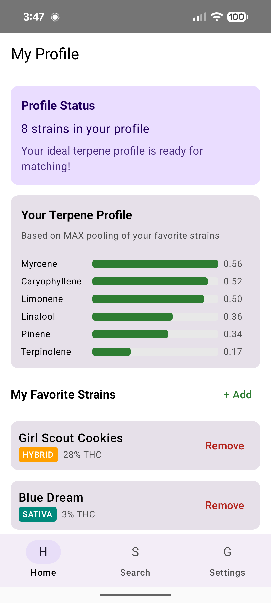
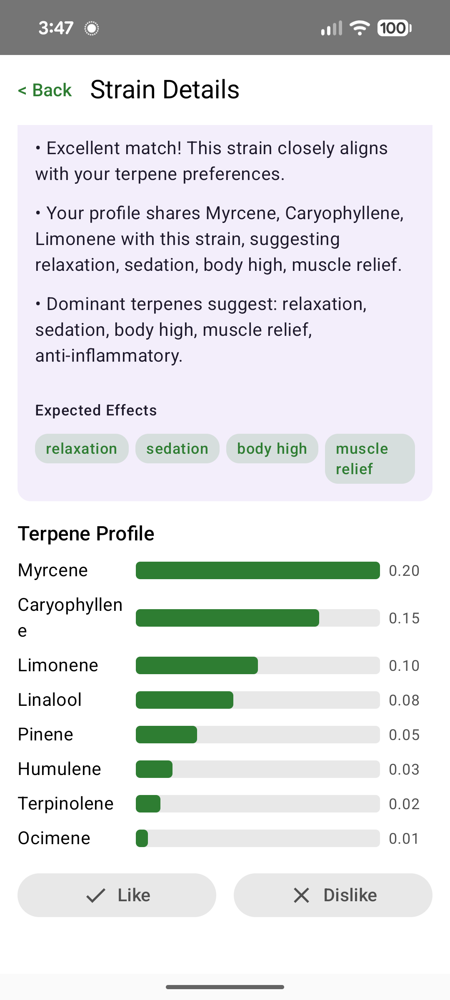
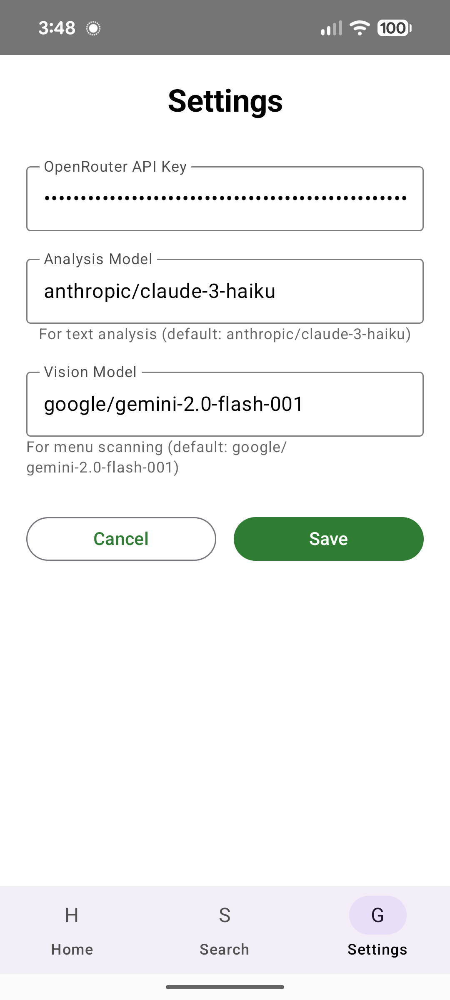
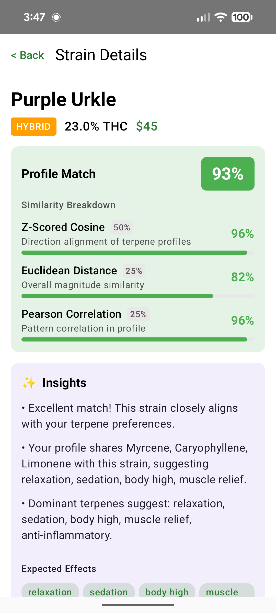

# BudMash

**Your Personal Terpene-Based Strain Matcher**

BudMash helps you find cannabis strains that match your preferences by building a terpene profile from strains you've liked, then scoring new strains against that profile using multiple similarity algorithms.

<p align="center">



</p>

## How It Works

### Building Your Terpene Profile

When you like a strain, BudMash extracts its terpene profile and adds it to your preferences. The app uses **MAX pooling** to build your ideal profile:

For each terpene, it takes the **maximum value** across all strains you've liked. This captures your peak preferences rather than averaging them down.

**Example:**
- You like Blue Dream (Myrcene: 0.4%, Limonene: 0.3%)
- You like Sour Diesel (Myrcene: 0.2%, Limonene: 0.5%)
- Your profile becomes: Myrcene: 0.4%, Limonene: 0.5%

This ensures that if you respond well to high limonene in one strain and high myrcene in another, both preferences are preserved.

### The Science: Similarity Scoring

BudMash uses three complementary algorithms to score how well a strain matches your profile:

#### 1. Z-Score Normalized Cosine Similarity (50% weight)

Before calculating similarity, both profiles are **z-score normalized**:
- Each terpene value is converted to: `(value - mean) / std_deviation`
- This transforms values into "standard deviations from the mean"
- A terpene at 2.0 means it's 2 standard deviations above average for that profile

**Why z-score first?** Raw terpene percentages vary wildly. Myrcene might be 0.5% while Terpinolene is 0.05%. Without normalization, high-concentration terpenes dominate the calculation. Z-scoring puts all terpenes on equal footing, so your preference for rare Terpinolene matters as much as common Myrcene.

Then **cosine similarity** is calculated:
- Measures the angle between two vectors in n-dimensional space
- Range: -1 to 1 (normalized to 0-100%)
- High score = profiles point in the same direction (same relative emphasis on terpenes)
- Ignores magnitude differences; focuses on proportional balance

#### 2. Euclidean Distance (25% weight)

Measures the straight-line distance between two points in terpene space:
- `sqrt(sum((a[i] - b[i])^2))` for each terpene i
- Converted to similarity: `1 / (1 + distance)`
- Then scaled to 0-100%

**What it catches:** Absolute concentration differences. Two strains might have the same *ratios* (high cosine) but vastly different *amounts*. If you prefer strains with 0.5% Myrcene, this penalizes strains with 0.1% even if their profile shape matches.

#### 3. Pearson Correlation (25% weight)

Measures how well the two profiles move together:
- If your profile is high in terpene X and low in Y, does the candidate follow the same pattern?
- Range: -1 to 1 (scaled to 0-100%)
- Complementary to cosine: Pearson removes each profile's mean before comparing, focusing purely on relative patterns

#### Combined Score

```
Final Score = (0.50 × Z-Cosine) + (0.25 × Euclidean) + (0.25 × Pearson)
```

This blend ensures:
- **Cosine** captures profile shape (dominant contribution)
- **Euclidean** catches magnitude mismatches
- **Pearson** validates the correlation pattern

A strain scoring 90%+ likely matches both the *shape* and *intensity* of your preferences.

## Using BudMash

### Step 1: Configure Your API Key



1. Go to **Settings** (gear icon)
2. Enter your OpenRouter API key
3. Select your preferred vision model (default: Gemini 2.0 Flash)

BudMash uses OpenRouter to access vision models for reading dispensary menus.

### Step 2: Build Your Profile

Start by liking strains you know you enjoy:

1. **Scan a menu** or **search by name**
2. View strain details
3. Tap the **thumbs up** on strains you like
4. Your terpene profile builds automatically

You can view your current profile in **My Profile** showing your aggregated terpene preferences.

### Step 3: Scan Dispensary Menus


1. Go to **Search**
2. Tap **Scan Menu Screenshot**
3. Select a screenshot of your dispensary's flower menu
4. BudMash extracts all strains using vision AI
5. Each strain is scored against your profile


Results show:
- **Match percentage** for each strain
- **Strain type** (Indica/Sativa/Hybrid) via color coding
- **THC/Price** when available from the menu

### Step 4: Explore Strain Details




Tap any strain to see:
- **Similarity breakdown** showing each algorithm's contribution
- **Expected effects** based on terpene analysis
- **Terpene profile** with visual bar chart
- **Like/Dislike** buttons to refine your preferences

### Text Search

If you know a strain name, use **Search by Name** to look it up directly. BudMash will fetch its terpene profile and compare it to yours.

## Key Terpenes

Understanding what each terpene contributes to your experience:

| Terpene | Aroma | Associated Effects |
|---------|-------|-------------------|
| **Myrcene** | Earthy, musky | Relaxation, sedation |
| **Limonene** | Citrus | Mood elevation, stress relief |
| **Caryophyllene** | Pepper, spicy | Anti-inflammatory, calming |
| **Pinene** | Pine | Alertness, memory retention |
| **Linalool** | Floral, lavender | Relaxation, anxiety relief |
| **Humulene** | Hoppy, earthy | Appetite suppression |
| **Terpinolene** | Floral, herbal | Uplifting, antioxidant |
| **Ocimene** | Sweet, herbal | Energizing, decongestant |

## Tips for Best Results

1. **Like at least 3-5 strains** before scanning menus. More data = better matching.

2. **Screenshots work best** when text is clearly visible. The AI reads strain names and THC percentages from the image.

3. **Tall scroll screenshots** are handled automatically. BudMash chunks large images to preserve text clarity.

4. **Dislike strains too.** While dislikes don't currently factor into scoring, tracking what you avoid helps you remember.

5. **Your profile evolves.** As you like more strains, your terpene profile refines. Early matches may improve over time.

## Privacy

- Your terpene profile is stored locally on your device
- API keys are stored in device secure storage
- No data is sent anywhere except to the vision API for menu analysis

---

*BudMash is for educational and personal preference tracking purposes. Always consume responsibly and in accordance with local laws.*
